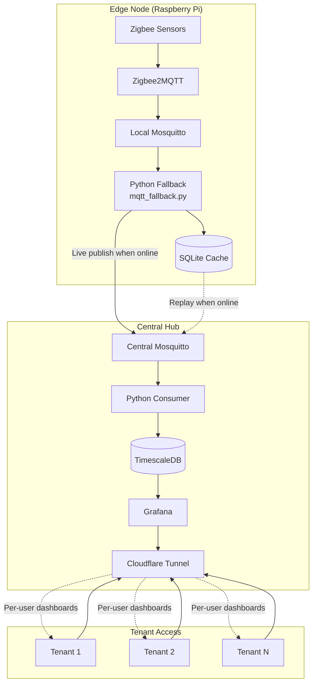
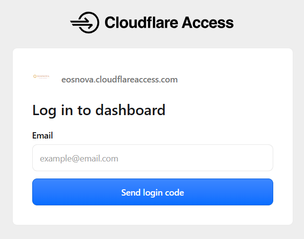
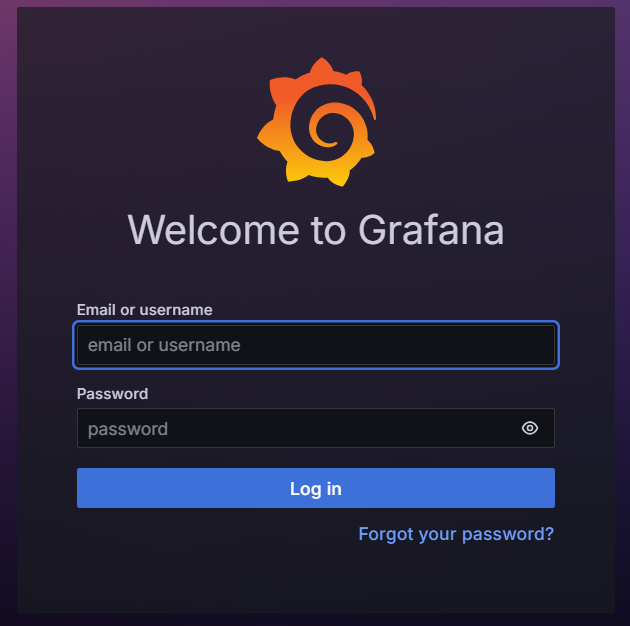

# Multi-Site IoT Monitoring Platform

A resilient, secure, and scalable smart home data pipeline designed for multi-household environments. Built for [EosNova](https://eosnova.eu/).

> **Note:** This repository is a showcase page. The source code is kept private because it powers a live production deployment. Demo access and a walkthrough are available on request — see [Contact](#contact) below.

---

## Overview

This platform collects real-time energy, environmental, and occupancy data from multiple Raspberry Pi edge nodes, stores it in a central TimescaleDB, and visualises it through Grafana dashboards.

It is designed for real-world reliability:

- **Zero data loss** — Edge nodes run a Python fallback that caches messages in SQLite during network outages and replays them to the central hub when the connection is restored.
- **Tenant isolation** — Each household has its own dashboard, with secure access controlled via Cloudflare.
- **Privacy first** — Data stays on private infrastructure; no third-party cloud dependency.
- **Open-source foundation** — Built on proven, well-documented tools.

---

## Architecture Overview

---

## Hardware

Each edge node consists of a Raspberry Pi running Zigbee2MQTT, a Zigbee USB coordinator, and the household's Zigbee devices.

| Raspberry Pi edge node | Zigbee sensors |
|:---:|:---:|
|  |  |

| Energy meter with CT clamps | Smart plug |
|:---:|:---:|
|  |  |

---

## Deployment Structure

| Component | Description |
|-----------|-------------|
| **`central-hub/`** | Central server: TimescaleDB, Grafana, Mosquitto, Python consumer, and backup script. |
| **`edge-node/`** | Raspberry Pi edge device: Zigbee2MQTT, local Mosquitto, and Python SQLite fallback. |

---

## Key Features

- **Resilient Data Pipeline** — A Python fallback caches messages in SQLite during outages and replays them when the central hub is reachable again.
- **Real-Time Monitoring** — Energy, temperature, humidity, illuminance, and motion data collected and visualised in real time.
- **Secure Remote Access** — Grafana dashboards exposed via Cloudflare Tunnel with email-based authentication.
- **Tenant Dashboards** — Each household gets an isolated dashboard, shareable via a secure link.
- **Automated Backups** — Daily database dumps with 30-day retention.

---

## Technology Stack

| Layer | Tools |
|-------|-------|
| **Edge Hardware** | Raspberry Pi, Zigbee USB Coordinator |
| **Edge Software** | Zigbee2MQTT, Mosquitto, Python, SQLite |
| **Messaging** | MQTT (Mosquitto) over Tailscale, authentication |
| **Database** | TimescaleDB (PostgreSQL extension) |
| **Visualisation** | Grafana |
| **Secure Access** | Cloudflare Tunnel, Cloudflare Access (email OTP) |
| **Orchestration** | Docker, Docker Compose |
| **Backup** | Custom shell script + cron |

---

<strong>Design decisions & trade-offs</strong>

**Why TimescaleDB over InfluxDB?**
TimescaleDB is a PostgreSQL extension, so it uses standard SQL. Dashboards, joins, and ad-hoc queries work with the tools we already knew. InfluxDB would have meant learning a new query language for no functional gain.

**Why MQTT over HTTP?**
MQTT is designed for low-bandwidth, intermittent links and has built-in QoS levels and persistent sessions. HTTP polling would waste power on the edge nodes and lose messages during brief network drops.

**Why Tailscale instead of a self-hosted VPN?**
Tailscale gives every node a stable IP regardless of the physical network, with WireGuard underneath. A self-hosted WireGuard setup would have been more work to maintain and would not have scaled as cleanly to new households.

**Why Cloudflare Tunnel instead of opening a port?**
No router configuration, no public IP, no open inbound port on the central hub. Outbound-only access also means the attack surface is much smaller.

**Why a Python SQLite fallback instead of a Mosquitto bridge?**
Both approaches solve the same problem — no data loss during outages. The Python fallback was chosen because the queue is easy to inspect (a plain SQLite file), the logic is fully visible in code, and it can be tested and reasoned about independently of the broker. A Mosquitto bridge would have been simpler to configure, but the resilience logic would have been opaque inside the broker.

---

<strong>What happens when things break</strong>

| Failure | Behaviour |
|---------|-----------|
| Edge node loses internet | Python fallback writes messages to SQLite; replay when the link returns |
| Central broker down | Fallback detects the disconnect, caches locally, and replays on reconnect |
| Central DB down | Consumer reconnects and buffers via MQTT QoS 1 persistent session |
| Grafana down | Data keeps flowing into TimescaleDB; dashboards recover on restart |
| Power loss at edge | UPS (optional) keeps the Pi and coordinator alive long enough for battery sensors to report |

---

<strong>Data collected per household</strong>

| Source | Fields |
|--------|--------|
| Smart meter | Voltage, current (A/B), power (A/B/AB), power factor, AC frequency, energy imported/exported, energy flow |
| Multisensor | Temperature, humidity, illuminance, motion, battery |
| Smart plugs | Power, current, voltage, energy, on/off state |
| Temp/humidity sensor | Temperature, humidity, battery |

Each row is stored with the household, device name, and a UTC timestamp.

---

<strong>Cloudflare Tunnel setup (technical detail)</strong>

The tunnel runs as a **host-level systemd service**, not inside Docker. This keeps remote access independent of the Docker stack — restarting containers does not drop the tunnel, and the tunnel can route to any service on the host.

### Access control

Cloudflare Access (Zero Trust → Access → Applications) sits in front of the tunnel hostname with an email OTP policy. Only approved email addresses can reach Grafana. Revoking access is done by removing the email from the policy — no changes are needed on the central hub.

Once authenticated, users land on the Grafana login page for their tenant account.

---

## Security Highlights

- **MQTT Authentication** — All broker connections (local and central) require a valid username and password. Anonymous access is disabled (`allow_anonymous false`).

- **Edge Firewall (UFW)** — Restricts inbound traffic on each edge node to only the central PC (port 1883) and the admin IP (port 22). All other ports are blocked.

- **No Ports Exposed to the Internet** — Cloudflare Tunnel provides outbound-only remote access to Grafana. No router port forwarding is required, and no service is reachable from the public internet.

- **Cloudflare Access (Email OTP)** — Tenants and admins must authenticate with a one-time PIN sent to an approved email address before reaching Grafana. Access is revoked simply by removing the email from the policy.

- **Per-User Dashboards** — Each tenant has their own Grafana user account and dashboard. Grafana dashboard permissions ensure tenants can only see their own household's data.

- **HTTPS / TLS Encryption** — All traffic between users and Cloudflare, and between Cloudflare and the origin, is encrypted (Full SSL/TLS mode).

- **Cloudflare WAF & Alerts** — A managed Web Application Firewall protects against common exploits, and email alerts notify the admin of security events.

- **Tailscale VPN** — Edge nodes and the central hub communicate over a private, encrypted Tailscale network. IP addresses are stable and independent of the physical network. MQTT traffic between edge nodes and the central broker travels over the Tailscale mesh, which is end-to-end encrypted (WireGuard).

- **Disable Anonymous Access** — No anonymous connections are allowed on any Mosquitto broker (central or edge).

- **SSH Key Authentication (Recommended)** — Password authentication is disabled on edge nodes; only SSH keys are accepted, and SSH is restricted to the admin IP via UFW.

- **Automated Backups** — Daily database dumps with 30-day retention protect against data loss and provide a recovery point in case of corruption.

- **No Third-Party Cloud Storage** — All data is stored on private infrastructure. No data is sent to external cloud providers (AWS, Google, etc.).

---

## Contact

Interested in a walkthrough, a demo, or the full source?

- **Email:** christzouvar@gmail.com
- **LinkedIn:** [Chris Tzouvaras](https://www.linkedin.com/in/christos-tzouvaras/)
- **Website:** [eosnova.eu](https://eosnova.eu/)
